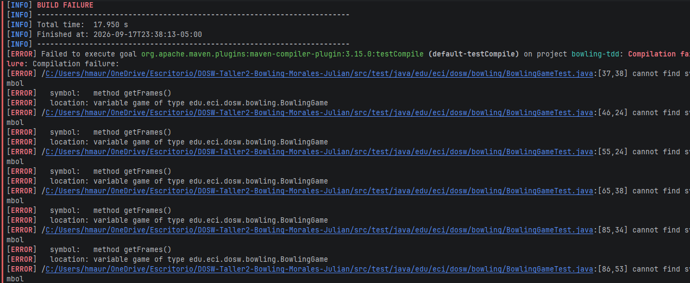
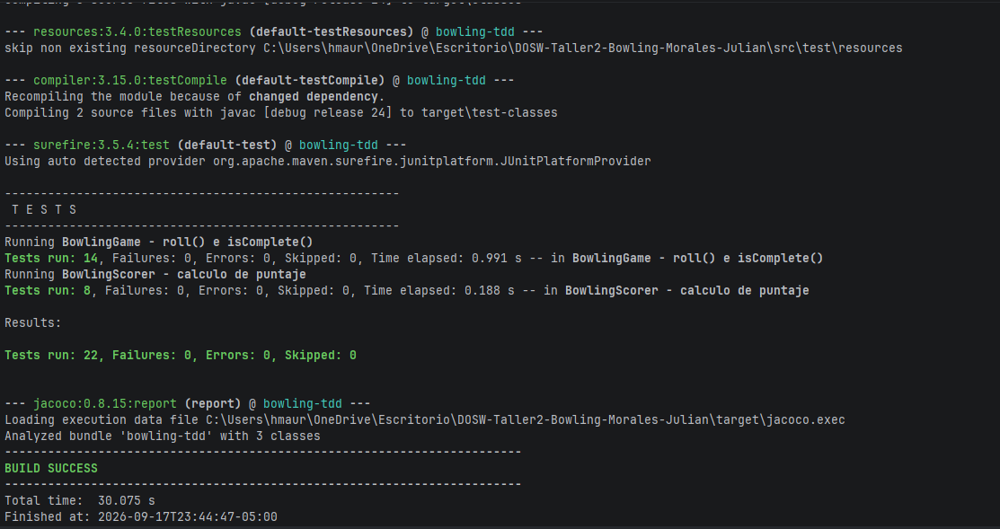
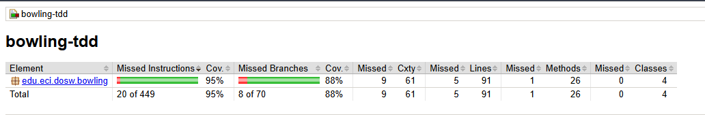
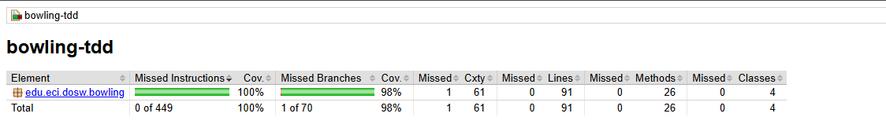

# 🎳 Bowling TDD — BowlTech S.A.S.

**DOSW 2026-2 · Taller 1 Corte 2 · TDD & Cobertura**
Java 24 · JUnit 5.13.4 · JaCoCo 0.8.15 · SonarQube

---

## 1. Identificación

| Campo | Valor |
|---|---|
| Nombre completo | Julian Felipe Morales Zambrano |
| Código estudiantil | 1000091825 |
| Correo institucional | julian.morales-z@mail.escuelaing.edu.co |
| Profesor | Andrés Martín Cantor Urrego |

---

## 2. Descripción

**BowlTech S.A.S.** administra pistas de bolos con un sistema de puntuación manual en el que se olvidan los bonos de strike, se confunden los spares y se calcula mal el juego perfecto. Este proyecto construye, aplicando TDD desde cero, el motor que registra los tiros de un jugador y calcula su puntaje.

### Reglas implementadas

| Situación | Condición | Puntuación |
|---|---|---|
| Tiro normal | Derriba algunos pinos sin completar 10 | Pinos derribados |
| Spare `/` | 10 pinos en los 2 tiros del frame | 10 + primer tiro del siguiente frame |
| Strike `X` | 10 pinos en el primer tiro | 10 + los dos tiros siguientes |
| Frame 10 | Strike o spare en el frame 10 | Hasta 3 tiros |
| Juego perfecto | 12 strikes seguidos | 300 |

Además se validan los tiros inválidos: pinos fuera de 0..10, tiros que superan los pinos que quedan en pie, tiros después de terminar el juego y pedir el puntaje antes de tiempo.

### Responsabilidades de cada clase

| Clase | Responsabilidad |
|---|---|
| `BowlingGame` | Punto de entrada. Recibe los tiros (`roll`), decide a qué frame van, avanza de frame, sabe si el juego terminó (`isComplete`) y entrega el puntaje (`score`) delegando en `BowlingScorer`. |
| `Frame` | Guarda los tiros de un frame y aplica sus reglas: cuántos tiros admite, cuántos pinos quedan en pie, si es strike o spare y cuándo está completo (incluido el tercer tiro del frame 10). |
| `FrameType` | Enum con los tipos de frame: `NORMAL`, `SPARE`, `STRIKE`, `TENTH`. |
| `BowlingScorer` | Clase sin estado. Recibe la lista de frames y calcula el puntaje de cada uno y el total aplicando los bonos. |

### Estructura

```
bowling-tdd/
├── src/main/java/edu/eci/dosw/bowling/
│   ├── BowlingGame.java
│   ├── Frame.java
│   ├── FrameType.java
│   └── BowlingScorer.java
├── src/test/java/edu/eci/dosw/bowling/
│   ├── BowlingGameTest.java        ← Módulos A y C
│   ├── BowlingScorerTest.java      ← Módulo B
│   ├── FrameTest.java              ← pruebas adicionales (tras JaCoCo)
│   └── BowlingEdgeCasesTest.java   ← pruebas adicionales (tras JaCoCo)
├── docs/evidence/
└── pom.xml
```

### Cómo ejecutar

```bash
mvn test                  # pruebas
mvn clean verify          # pruebas + reporte JaCoCo + umbral 85%
```

---

## 3. Evidencia TDD

Ciclo documentado: **A2 — `roll(-1)` lanza `IllegalArgumentException`**

**🔴 RED** — la prueba se escribió antes del código y falló porque `roll()` estaba vacío.



Commit: `test: RED - roll lanza excepcion con pines negativos`

**🟢 GREEN** — se agregó la validación mínima `if (pins < 0) throw new IllegalArgumentException(...)`.



Commit: `feat: GREEN - valida pines negativos`

**🔵 REFACTOR** — tras A3 (`roll(11)`), la validación de rango se extrajo a `Frame.requireValidPins()` con la constante `MAX_PINS`, y las pruebas siguieron en verde.

Commit: `refactor: extrae validacion de rango de pines`

---

## 4. JaCoCo

| Momento | Cobertura de líneas | Cobertura de ramas |
|---|---|---|
| Antes (solo módulos A, B y C) | `__ %` | `__ %` |
| Final (con pruebas adicionales) | `__ %` | `__ %` |

**Antes**



**Final**



### Pruebas que subieron la cobertura

- `FrameTest`: número de frame fuera de rango, agregar un tiro a un frame ya completo, tipo `TENTH`, y el frame 10 con tiros bonus inválidos (strike, 3 y luego 8) o válidos (strike, 0, 10 y spare + 10).
- `BowlingEdgeCasesTest`: `BowlingScorer` con un juego en curso (bonos incompletos), strike en el frame 9 que toma su bono del frame 10, partida mixta de referencia (167) y copias inmutables de `getFrames()` y `getRolls()`.

---

## 5. SonarQube


| Métrica | Valor |
|---|---|
| Quality Gate | `Passed / Failed` |
| Cobertura | `__ %` |
| Bugs | `__` |
| Vulnerabilidades | `__` |
| Code Smells | `__` |
| Duplicación | `__ %` |

**Issues encontrados y corregidos:**

| Issue | Archivo | Cambio realizado |
|---|---|---|
| `__________` | `__________` | `__________` |

---

## 6. Pull Requests

| PR | Módulo que cubre | Fecha de merge |
|---|---|---|
| [#1](https://github.com/JulianMorales2003/DOSW-Taller2-Bowling-Morales-Julian/pull/1) | Setup (Java 24, JUnit 5.13.4, JaCoCo), módulos A, B y C completos, ciclo RED → GREEN → REFACTOR y pruebas adicionales de cobertura | `____-__-__` |
| [#2](https://github.com/JulianMorales2003/DOSW-Taller2-Bowling-Morales-Julian/pull/2) | SonarQube, limpieza de scripts auxiliares y README final | `____-__-__` |

---

## 7. Reflexión técnica

**01. ¿Qué caso edge del Bowling fue el más difícil de implementar con TDD y por qué?**

El frame 10. En los frames 1 a 9 la regla es simple: un strike cierra el frame y si no, se cierra con dos tiros que no pueden sumar más de 10. En el frame 10 un strike o un spare dan tiros extra y los pinos se vuelven a parar, así que "strike, 10, 10" es válido pero "strike, 3, 8" no. Mi primera versión solo restaba los pinos del frame y rechazaba el bonus de C4. La solución fue calcular los pinos en pie recorriendo los tiros y reiniciando a 10 cada vez que la pista queda limpia; con esa misma función los frames normales y el frame 10 quedaron cubiertos.

**02. ¿Qué parte del código cambió durante REFACTOR sin modificar el comportamiento observable?**

- La validación de rango de pines pasó de estar en `roll()` a `Frame.requireValidPins()`, reutilizada por `BowlingGame` y `Frame`.
- Los números mágicos (10, 2, 3) se volvieron constantes (`MAX_PINS`, `REGULAR_MAX_ROLLS`, `TENTH_MAX_ROLLS`).
- En `BowlingScorer` el cálculo se separó en `scoreByFrame()`, `frameScore()` y `bonus()`. Al hacerlo noté que el frame 10 no necesita un caso especial, porque sus tiros extra ya están en la lista y el bono da exactamente su suma.

**03. ¿Qué casos de prueba descubriste al revisar el reporte de JaCoCo que no habías considerado antes?**

El reporte mostró en rojo ramas que los módulos A, B y C nunca ejecutaban: agregar un tiro a un frame ya completo, crear un frame con número fuera de 1..10, el tercer tiro del frame 10 superando los pinos en pie (strike, 3, 8) y el `bonus()` del scorer cuando todavía no se han lanzado los tiros siguientes. También noté que B6 y B7 pasaron sin escribir código nuevo, lo que confirmó que la lógica de bonos ya cubría el frame 10.

**04. ¿Qué hallazgo de SonarQube produjo un cambio real en el código?**

`__________ (completar con un issue real del dashboard: qué regla marcó, en qué archivo y qué cambiaste)`